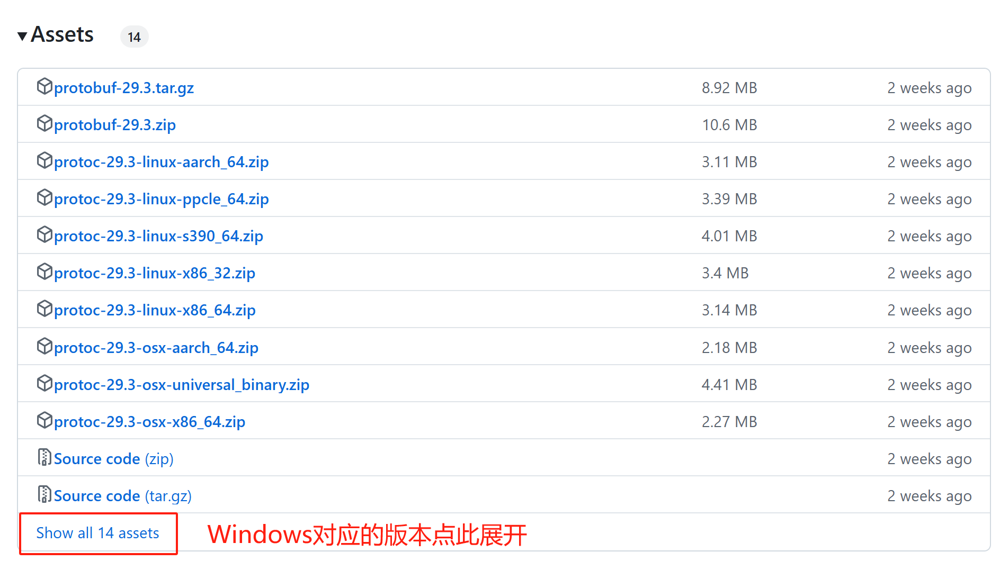

# 将proto文件转为go代码
## 1. 安装protoc
### Linux
```Shell
$ apt install -y protobuf-compiler
$ protoc --version  
```
-y等价于--yes，如果安装出现一些“确认提示”，需要你输入yes或no，-y会自动帮你输入yes，避免安装流程被中断。
### Windows
（此方法适用于所有操作系统）
到[protocolbuffers官网](https://github.com/protocolbuffers/protobuf/releases)上下载最新版的编译好的protoc可执行行文件。  

解压后bin目录下有个protoc的可执行文件，把它放到环境变量PATH的某一个目录（比如$GOPATH/bin）里面去，这样就可以在任意目录下使用protoc命令了。  
```Shell
$ protoc --version
libprotoc 3.19.6
```
### MacOS
```Shell
$ brew install protobuf
$ protoc --version  
```
## 2. 安装生成go代码的插件
```Shell
go install google.golang.org/protobuf/cmd/protoc-gen-go@latest
go install google.golang.org/grpc/cmd/protoc-gen-go-grpc@latest
```
这个命令会在你的GOPATH/bin下生成一个可执行文件protoc-gen-go，前提是你已经安装好了go开发环境，配好了GOPATH。  
