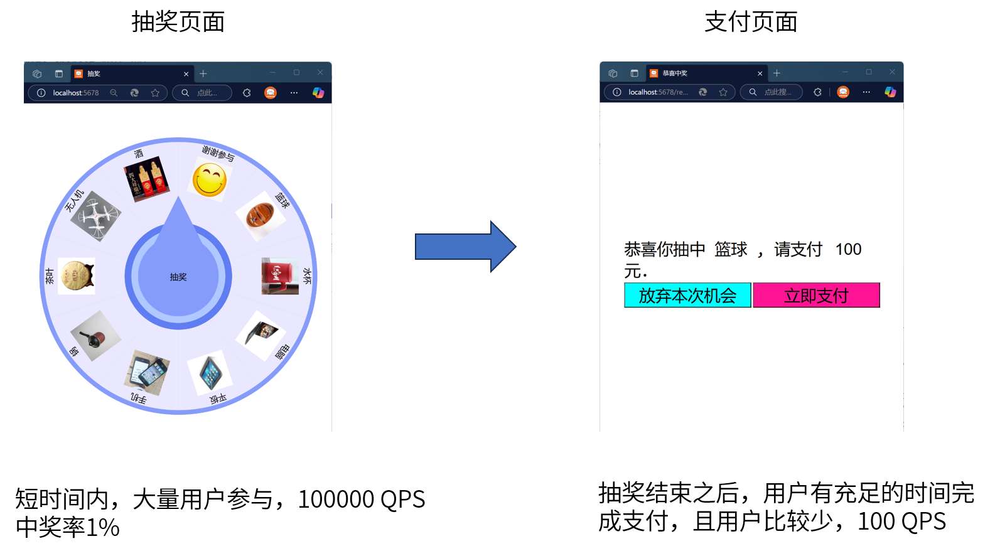
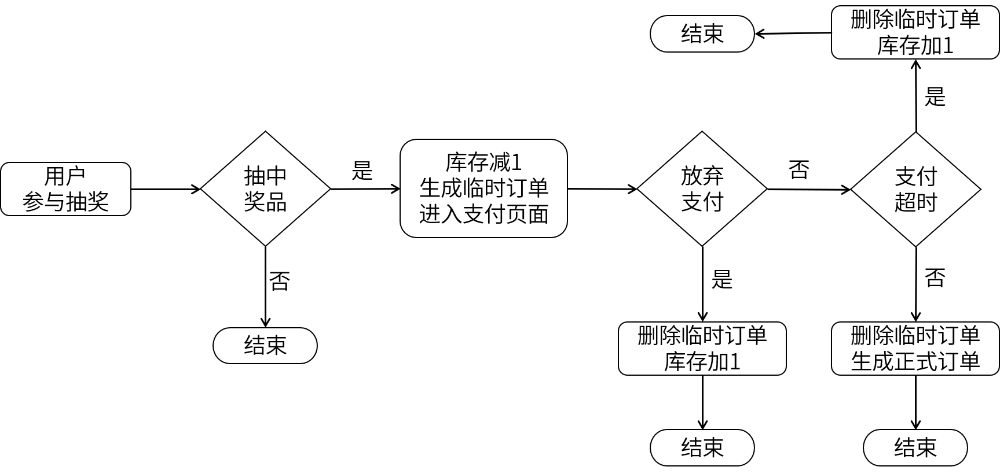

## 建表
```sql
create database lottery;
grant all on lottery.* to tester;
use lottery;

create table if not exists inventory(
    id int auto_increment comment '奖品id，自增',
    name varchar(20) not null comment '奖品名称',
    description varchar(100) not null default '' comment '奖品描述',
    picture varchar(200) not null default '' comment '奖品图片',
    price int not null default 0 comment '价值',
    count int not null default 0 comment '库存量',
    primary key (id)
)default charset=utf8mb4 comment '奖品库存表，所有奖品在一次活动中要全部发出去';

insert into inventory (id,name,picture,price,count) values (1,'谢谢参与','img/face.png',0,1000);    --'谢谢参与'的id我要显式指定，因为go代码里我要写死这个id
insert into inventory (name,picture,price,count) values 
('篮球','img/ball.jpeg',100,1000),
('水杯','img/cup.jpeg',80,1000),
('电脑','img/laptop.jpeg',6000,200),
('平板','img/pad.jpg',4000,300),
('手机','img/phone.jpeg',5000,400),
('锅','img/pot.jpeg',120,1000),
('茶叶','img/tea.jpeg',90,1000),
('无人机','img/uav.jpeg',400,100),
('酒','img/wine.jpeg',160,500);

create table if not exists orders(
    id int auto_increment comment '订单id，自增',
    gift_id int not null comment '商品id',
    user_id int not null comment '用户id',
    count int not null default 1 comment '购买数量',
    create_time datetime default current_timestamp comment '订单创建时间',
    primary key (id),
    key idx_user (user_id)
)default charset=utf8mb4 comment '订单表';
```  

- 为了方便进行压力测试，我故意把库存量（count）设得很大，实际中可以把库存量设得很小。
- 指定一个特殊的id来标识“谢谢参与”，通过调节“谢谢参与”的count来控制它被抽中的概率。

## 业务流程


## 程序流程


## 高并发抽奖算法
假设有3件奖品，库存分别是5、2、4，要把这么奖品全部发出去。  
1. 根据当前的剩余库存计算每个奖品被抽中的概率。probs=(0.45, 0.18, 0.36)
2. 计算累积概率。acc=(0.45, 0.64, 1.0)，把线段[0,1]切分成三段
3. 生成(0,1]上的随机浮点数，落在哪一段上就抽中哪个奖品
4. 抽中一个奖品对应的库存减1  

每次抽奖都要重新走上面4步。
读库存和减库存都涉及到DB的操作，在大数据、高并发场景下(比如支付宝在春晚搞抽奖活动)Redis能承受的QPS比Mysql高一到两个数量级，所以实时库存放到Redis上去维护。
库存量很低的时候考虑一个极端情况：奖品还剩1件库存，2个协程同时去读这个库存，发现还剩1件，刚好又都抽中了这个奖品，于是2个协程同时去减1，还好Redis的Decr是原子操作。减1后如果发现库存为负数，则说明减库存失败，失败则需要重新走一遍抽奖算法。所以只有当减库存成功后才能给前端返回抽奖的结果，跟秒杀场景是一个道理。  

## 后端接口
|请求路径|请求方式|请求参数|说明|
| :--- | :--- | :--- | :--- |
|/|GET||返回抽奖转盘页面|
|/gifts|GET||返回所有奖品的详细信息，用于往转盘里填充内容|
|/lucky|GET||返回抽中的奖品ID|  
|/giveup|POST|uid和gid|不支付，放弃这次抽中的机会|  
|/pay|POST|uid和gid|完成支付|  
|/result|GET||抽奖成功页面|  

## 前端展现
直接使用[lucky-canvas](https://100px.net/usage/js.html)抽奖插件。