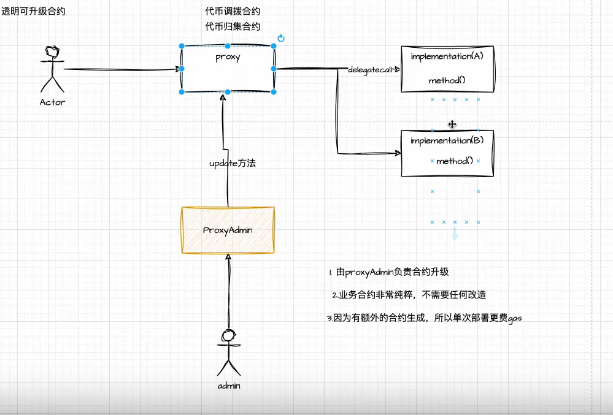
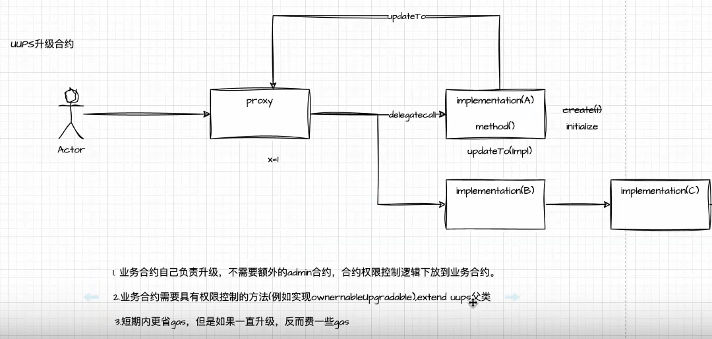
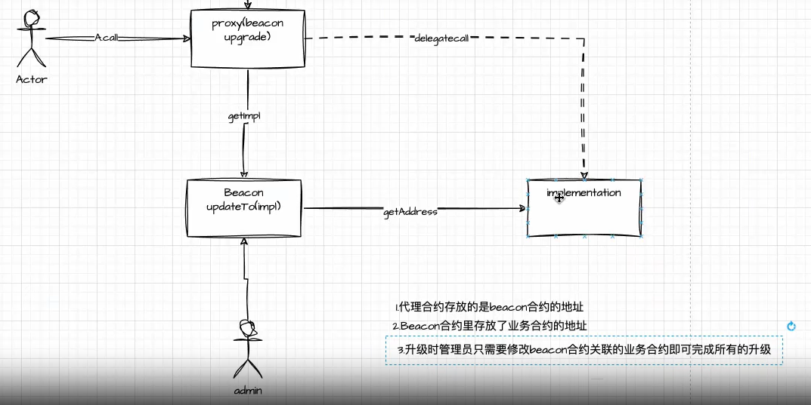

***第五周***
### solidity 插槽机制

**state variable**:  
- immutable 可变，存储在bytecode里
- mutable（storage variable） 不可变变量，存储在slots里 

***slots***: 智能合约存储的一种组织形式，每一个slot是32字节，256bits,0~2^256 -1

- 编译器分配storage空间给状态变量，有序，确定的规则，基于变量的定义顺序，每个slot都有缺省值
- 为了节省存储空间，会将不满256bit的slot进行压缩，凑满一个slot 
- solidity package variable 是从最低有效位开始，从右到左，进行打包。当我们按顺序定义变量时，总大小小于256bit,会被安排到一个slot里
- 对于复杂数据类型，如array/mapping.存储的是类似于指针的地址。指向实际存储数据的地方（加密哈希的抗碰撞性）


### YUL语言 
- 可以使用最底层的语法和以太坊交互，gas效率更高
- 处理一些solidity未提供的api功能,比如:
  1. write to any slot
  2. deploy any contract
  3. verifing signature
- 一定程度上可以屏蔽solidity版本的变迁
  
  ```solidity
  assembly{
    content :=sload(index)
  }
  ```

### 可升级合约（设计模式）

？ 业务升级
？ 重大的代码bug

代理模式（delegatecall）——>storage slot + 业务逻辑

状态A----通过函数（交易方式）----状态B


***EIP1967协议***：

- 透明可升级合约
- uupss升级合约
- Beacon

合约逻辑是什么？（logic contract）
谁可以升级这个合约？（管理员合约的位置）

##### 透明可升级合约



##### uups



##### Beacon



******

***第六周***

